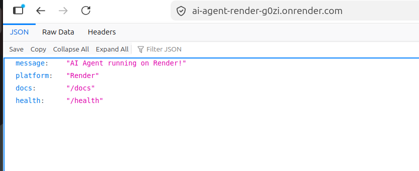
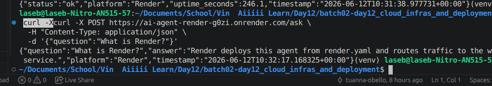

# Solution - Day 12 Cloud Infrastructure And Deployment

> Sinh viên: Nguyễn Công Thành  
> MSSV: 2A202600696  
> Repository: `thanh-code/batch02-day12_cloud_infras_and_deployment`  
> Cloud platform được chọn: Render  
> Public URL Part 03: https://ai-agent-render-g0zi.onrender.com

## 1. Tổng Quan

Bài lab Day 12 yêu cầu triển khai một AI Agent từ môi trường local lên môi trường production/cloud. Nội dung chính của bài gồm:

- Phân biệt development và production.
- Containerize ứng dụng bằng Docker.
- Deploy ứng dụng lên cloud platform.
- Bảo mật API bằng authentication, rate limiting và cost guard.
- Thiết kế hệ thống có khả năng scale và reliability.
- Chuẩn bị final production-ready agent ở Part 6.

Trong bài này, em chọn **Render** làm nền tảng cloud chính thay vì Railway.

## 2. Danh Sách File/Thư Mục Chính

| File/thư mục | Vai trò |
|---|---|
| `CODE_LAB.md` | Đề bài chính, gồm Part 1 đến Part 6 |
| `DAY12_DELIVERY_CHECKLIST.md` | Checklist yêu cầu nộp bài |
| `01-localhost-vs-production/` | So sánh code chạy local và code production |
| `02-docker/` | Dockerfile cơ bản, Dockerfile production và Docker Compose |
| `03-cloud-deployment/render/` | Source deploy Part 03 lên Render |
| `04-api-gateway/` | Authentication, JWT, rate limiting, cost guard |
| `05-scaling-reliability/` | Health check, readiness, stateless design, load balancing |
| `06-lab-complete/` | Final project, sẽ cập nhật/sửa sau |
| `Pic1.png` | Ảnh minh chứng Part 03: web service trả JSON trên browser |
| `Pic2.png` | Ảnh minh chứng Part 03: test `/health` và `/ask` bằng terminal |

## 3. Part 1 - Localhost Vs Production

### 3.1. Exercise 1.1 - Anti-patterns tìm thấy

Các vấn đề thường gặp trong bản development:

1. Hardcode API key hoặc secret trong source code.
2. Hardcode host/port thay vì đọc từ environment variables.
3. Bật debug mode khi chạy production.
4. Thiếu endpoint `/health`.
5. Thiếu endpoint `/ready`.
6. Logging bằng `print()` thay vì structured logging.
7. Không xử lý graceful shutdown.
8. Lưu state trong memory, không phù hợp khi scale nhiều instance.
9. Không có cơ chế rate limiting.
10. Không có cost guard để tránh vượt chi phí khi dùng LLM thật.

### 3.2. Exercise 1.3 - So sánh Develop và Production

| Feature | Develop | Production | Tại sao quan trọng? |
|---|---|---|---|
| Config | Hardcode | Environment variables | Deploy nhiều môi trường mà không sửa code |
| Secrets | Có thể nằm trong code | Lấy từ `.env` hoặc cloud secret | Tránh lộ key trên GitHub |
| Port | Cố định | Đọc từ biến `PORT` | Cloud platform thường cấp port động |
| Health check | Có thể thiếu | Có `/health` | Platform biết app còn sống |
| Readiness check | Có thể thiếu | Có `/ready` | Chỉ nhận traffic khi app sẵn sàng |
| Logging | `print()` | JSON structured logging | Dễ debug, monitor, filter log |
| Shutdown | Tắt đột ngột | Graceful shutdown | Giảm mất request khi restart/deploy |
| State | In-memory | Redis/external storage | Scale nhiều instance vẫn giữ state |

### 3.3. Kết luận Part 1

Production app cần tách cấu hình khỏi code, tránh hardcode secrets, có health/readiness check, logging rõ ràng và xử lý shutdown đúng cách.

## 4. Part 2 - Docker Containerization

### 4.1. Exercise 2.1 - Dockerfile cơ bản

Trong `02-docker/develop/Dockerfile`:

```dockerfile
FROM python:3.11
WORKDIR /app
COPY 02-docker/develop/requirements.txt .
RUN pip install --no-cache-dir -r requirements.txt
COPY 02-docker/develop/app.py .
CMD ["python", "app.py"]
```

Trả lời câu hỏi:

1. **Base image là gì?**  
   Base image là `python:3.11`. Đây là image Python đầy đủ, dễ dùng cho development nhưng thường có kích thước lớn.

2. **Working directory là gì?**  
   Working directory là `/app`. Các lệnh sau `WORKDIR /app` sẽ chạy trong thư mục này.

3. **Tại sao copy `requirements.txt` trước?**  
   Vì Docker build theo layer cache. Nếu dependencies không đổi, Docker có thể dùng lại layer cài package, giúp build nhanh hơn khi chỉ sửa code.

4. **`CMD` và `ENTRYPOINT` khác nhau thế nào?**  
   `CMD` là lệnh mặc định khi container chạy và dễ override. `ENTRYPOINT` cố định lệnh chính của container, thường dùng khi image được thiết kế như một executable.

### 4.2. Exercise 2.3 - Multi-stage build

Trong Dockerfile production, multi-stage build thường gồm:

| Stage | Mục đích |
|---|---|
| Builder | Cài dependencies và chuẩn bị runtime packages |
| Runtime | Chỉ copy code và dependencies cần chạy |

Lợi ích:

- Image nhỏ hơn.
- Ít file thừa hơn.
- Ít attack surface hơn.
- Build tách khỏi runtime.

Kết quả đã ghi nhận trong quá trình làm bài:

- Part 2 production Docker image build thành công.
- Image production khoảng 68 MB.
- `docker compose config` của Part 2 production pass.

### 4.3. Exercise 2.4 - Docker Compose stack

Kiến trúc Docker Compose production:

```text
Client
  |
  v
Nginx
  |
  v
FastAPI Agent
```

Nginx đóng vai trò reverse proxy/load balancer. Agent chạy phía sau và nhận request từ Nginx qua Docker network nội bộ.

## 5. Part 3 - Cloud Deployment Trên Render

### 5.1. Nền tảng chọn

Em chọn **Render** để deploy Part 03.

Lý do:

- Có free plan phù hợp học tập.
- Có giao diện web dễ dùng.
- Hỗ trợ Python/FastAPI.
- Hỗ trợ Blueprint bằng `render.yaml`.
- Có public URL dạng `onrender.com`.
- Có logs, health check và auto deploy từ GitHub.

### 5.2. File Render của Part 03

Thư mục deploy:

```text
03-cloud-deployment/render/
├── app.py
├── requirements.txt
└── render.yaml
```

Nội dung chính của `render.yaml`:

```yaml
services:
  - type: web
    name: ai-agent-render
    runtime: python
    region: singapore
    plan: free
    rootDir: 03-cloud-deployment/render
    buildCommand: pip install -r requirements.txt
    startCommand: uvicorn app:app --host 0.0.0.0 --port $PORT
    healthCheckPath: /health
    autoDeployTrigger: commit
```

Ý nghĩa:

| Trường | Ý nghĩa |
|---|---|
| `type: web` | Tạo web service có public URL |
| `runtime: python` | Render dùng Python runtime |
| `region: singapore` | Chọn region Singapore, gần Việt Nam |
| `plan: free` | Dùng gói miễn phí |
| `rootDir` | Chỉ định thư mục app cần build |
| `buildCommand` | Cài dependencies |
| `startCommand` | Chạy FastAPI bằng Uvicorn |
| `healthCheckPath` | Render dùng `/health` để kiểm tra service |

### 5.3. Thao tác trên Render

Các bước đã thực hiện:

1. Push source code lên GitHub.
2. Vào Render Dashboard.
3. Chọn `New` -> `Blueprint`.
4. Chọn repository:

```text
thanh-code/batch02-day12_cloud_infras_and_deployment
```

5. Điền Blueprint:

```text
Blueprint Name: day12-part03-render
Branch: main
Blueprint Path: 03-cloud-deployment/render/render.yaml
```

6. Render đọc Blueprint và hiển thị:

```text
Create web service ai-agent-render
```

7. Deploy Blueprint.
8. Sau khi deploy xong, service có trạng thái live.

### 5.4. Thông tin service Render

| Mục | Giá trị |
|---|---|
| Service type | Web Service |
| Service name | `ai-agent-render` |
| Runtime | Python 3 |
| Plan | Free |
| Service ID | `srv-d8lttggg4nts73fqtrg0` |
| Blueprint managed | Có |
| Repository | `thanh-code/batch02-day12_cloud_infras_and_deployment` |
| Branch | `main` |
| Public URL | https://ai-agent-render-g0zi.onrender.com |
| Deploy commit | `39b1c16` - Test2 |
| Deploy time | June 12, 2026 at 5:27 PM |

Render có cảnh báo:

```text
Your free instance will spin down with inactivity, which can delay requests by 50 seconds or more.
```

Điều này là bình thường với gói Free. Nếu service lâu không có traffic, request đầu tiên sau đó có thể chậm hơn vì Render cần bật lại instance.

### 5.5. Test endpoint `/`

URL:

```text
https://ai-agent-render-g0zi.onrender.com/
```

Kết quả trên browser:

```json
{
  "message": "AI Agent running on Render!",
  "platform": "Render",
  "docs": "/docs",
  "health": "/health"
}
```

Ảnh minh chứng:



### 5.6. Test endpoint `/health`

Command:

```bash
curl https://ai-agent-render-g0zi.onrender.com/health
```

Kết quả:

```json
{
  "status": "ok",
  "platform": "Render",
  "uptime_seconds": 246.1,
  "timestamp": "2026-06-12T10:31:38.977731+00:00"
}
```

Ý nghĩa:

- `status: ok`: app đang sống.
- `platform: Render`: app đang chạy trên Render.
- `uptime_seconds`: thời gian service đã chạy.
- `timestamp`: thời điểm server trả response.

### 5.7. Test endpoint `/ask`

Command:

```bash
curl -X POST https://ai-agent-render-g0zi.onrender.com/ask \
  -H "Content-Type: application/json" \
  -d '{"question":"What is Render?"}'
```

Kết quả:

```json
{
  "question": "What is Render?",
  "answer": "Render deploys this agent from render.yaml and routes traffic to the web service.",
  "platform": "Render",
  "timestamp": "2026-06-12T10:32:17.168325+00:00"
}
```

Ảnh minh chứng test terminal:



### 5.8. Kết luận Part 3

Part 03 đã deploy thành công lên Render. Public URL hoạt động, endpoint `/health` trả status OK và endpoint `/ask` trả response mock AI đúng như code trong `app.py`.

## 6. Part 4 - API Security

### 6.1. Exercise 4.1 - API Key Authentication

API key authentication yêu cầu client gửi key trong header:

```http
X-API-Key: <secret-key>
```

Nếu không có key hoặc key sai, API phải trả lỗi `401 Unauthorized` hoặc `403 Forbidden`.

Lý do cần API key:

- Public URL có thể bị bất kỳ ai gọi.
- Nếu dùng LLM thật, request lạ có thể làm tăng chi phí.
- API key giúp chỉ người được cấp quyền mới dùng được service.

Cách rotate API key:

1. Tạo API key mới trong `.env` hoặc Render Environment Variables.
2. Redeploy/restart service.
3. Cập nhật client dùng key mới.
4. Thu hồi key cũ.

### 6.2. Exercise 4.2 - JWT Authentication

JWT flow:

```text
Client login
  -> Server kiểm tra username/password
  -> Server tạo JWT
  -> Client gửi Authorization: Bearer <token>
  -> Server verify chữ ký và hạn token
  -> Request hợp lệ thì xử lý
```

JWT thường chứa:

- `sub`: user identifier.
- `role`: quyền của user.
- `iat`: thời điểm tạo token.
- `exp`: thời điểm hết hạn.

Ưu điểm:

- Stateless, server không cần lưu session.
- Phù hợp API scale nhiều instance.
- Có thể gắn role/permission.

### 6.3. Exercise 4.3 - Rate Limiting

Rate limiting dùng để giới hạn số request trong một khoảng thời gian.

Trong bài:

- User thường: 10 requests/phút.
- Admin: có thể được limit cao hơn.
- Khi vượt limit, API trả `429 Too Many Requests`.

Algorithm được học:

```text
Sliding Window Counter
```

Ý tưởng:

1. Lưu timestamp của các request theo user.
2. Xóa các timestamp nằm ngoài window.
3. Nếu số request trong window vượt limit thì chặn.
4. Nếu chưa vượt thì ghi nhận request mới.

### 6.4. Exercise 4.4 - Cost Guard

Cost guard dùng để tránh vượt chi phí khi gọi LLM.

Logic cần có:

```text
Mỗi user có budget 10 USD/tháng
  -> Trước request: kiểm tra budget còn đủ không
  -> Sau request: ghi nhận chi phí ước tính
  -> Nếu vượt budget: trả lỗi 402 Payment Required
```

Nếu scale nhiều instance, usage nên lưu trong Redis thay vì memory.

Pseudo-code:

```python
def check_budget(user_id: str, estimated_cost: float) -> bool:
    month_key = current_month()
    key = f"budget:{user_id}:{month_key}"
    current = redis.get(key) or 0

    if current + estimated_cost > 10:
        return False

    redis.incrbyfloat(key, estimated_cost)
    redis.expire(key, 32 * 24 * 3600)
    return True
```

## 7. Part 5 - Scaling And Reliability

### 7.1. Exercise 5.1 - Health Check và Readiness Check

`/health` là liveness probe:

- Kiểm tra process/app còn sống.
- Nếu fail, platform có thể restart container.

`/ready` là readiness probe:

- Kiểm tra app đã sẵn sàng nhận traffic chưa.
- Có thể check Redis/database.
- Nếu chưa ready, trả `503`.

Ví dụ:

```python
@app.get("/health")
def health():
    return {"status": "ok"}

@app.get("/ready")
def ready():
    try:
        redis.ping()
        return {"status": "ready"}
    except Exception:
        return JSONResponse(status_code=503, content={"status": "not ready"})
```

### 7.2. Exercise 5.2 - Graceful Shutdown

Khi platform muốn tắt container, nó gửi signal `SIGTERM`.

App production nên:

1. Dừng nhận request mới.
2. Đánh dấu `/ready` là not ready.
3. Chờ request đang xử lý hoàn tất.
4. Đóng kết nối Redis/database.
5. Thoát process an toàn.

### 7.3. Exercise 5.3 - Stateless Design

Anti-pattern:

```python
conversation_history = {}
```

Vấn đề:

- Mỗi instance có memory riêng.
- Khi load balancer chuyển request sang instance khác, history có thể mất.
- Khi restart container, memory mất hết.

Thiết kế đúng:

```text
App instance 1
App instance 2  -> Redis -> conversation history
App instance 3
```

Redis giúp các instance cùng đọc/ghi một nguồn state chung.

### 7.4. Exercise 5.4 - Load Balancing

Kiến trúc load balancing:

```text
Client
  |
  v
Nginx
  |
  +--> Agent instance 1
  +--> Agent instance 2
  +--> Agent instance 3
        |
        v
      Redis
```

Chạy local:

```bash
docker compose up --scale agent=3
```

Nginx phân phối request đến nhiều agent instance. Redis đảm bảo state không phụ thuộc vào một instance cụ thể.

### 7.5. Exercise 5.5 - Test Stateless

Kịch bản test:

1. Gửi request tạo conversation.
2. Kill một instance bất kỳ.
3. Gửi tiếp request với cùng session.
4. Kiểm tra history vẫn còn.

Kết luận:

- Nếu history còn, app đã stateless đúng.
- Nếu history mất, app vẫn đang phụ thuộc vào memory của một instance.

## 8. Part 6 - Final Project

Phần này **sẽ được sửa/cập nhật sau** theo kế hoạch tiếp theo.

Trạng thái hiện tại:

- `06-lab-complete/` đã có cấu trúc final project.
- Tuy nhiên trong bản `Solution.md` này, em chưa chốt báo cáo Part 6.
- Sau khi sửa xong Part 6, cần cập nhật thêm:
  - Kiến trúc final project.
  - Endpoint final.
  - Kết quả `check_production_ready.py`.
  - Kết quả Docker build.
  - Kết quả deploy Render cho bản final nếu có.

## 9. Checklist Hiện Tại

| Mục | Trạng thái |
|---|---|
| Part 1 - Localhost vs Production | Hoàn thành |
| Part 2 - Docker | Hoàn thành |
| Part 3 - Render deployment | Hoàn thành |
| Part 3 - Có public URL | Hoàn thành |
| Part 3 - Có ảnh minh chứng | Hoàn thành: `Pic1.png`, `Pic2.png` |
| Part 4 - API Security | Hoàn thành phần trả lời |
| Part 5 - Scaling & Reliability | Hoàn thành phần trả lời |
| Part 6 - Final Project | Sẽ sửa/cập nhật sau |

## 10. Tài Liệu Tham Khảo

- Render Blueprint Specification: https://render.com/docs/blueprint-spec
- Render Blueprints: https://render.com/docs/infrastructure-as-code
- Render FastAPI Deployment: https://render.com/docs/deploy-fastapi
- Render Web Services: https://render.com/docs/web-services
- Render Free Plan: https://render.com/docs/free
- FastAPI Deployment: https://fastapi.tiangolo.com/deployment/
- Docker Best Practices: https://docs.docker.com/develop/dev-best-practices/
- 12-Factor App: https://12factor.net/
